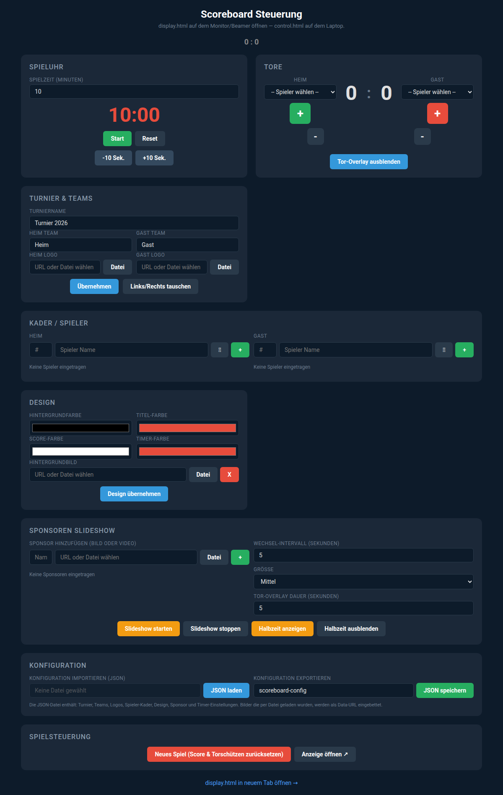
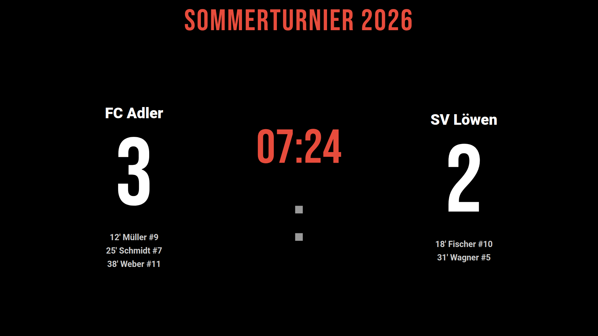

# Scoreboard

**[English](#english) | [Deutsch](#deutsch)**

---

## English

Web-based scoreboard system for live display of match scores at tournaments. Consists of a **control panel** (laptop) and a **display** (monitor/projector) that communicate via the browser.

### Features

- Game clock with start/stop/reset and manual adjustment
- Goal tracking with player assignment and minute display
- Goal overlay animation with player photo and team name
- Squad management with jersey number, name, and photo
- Tournament and team configuration (name, logo)
- Design customization (colors, background image)
- Sponsor slideshow (images & videos) in various sizes
- Halftime overlay
- JSON import/export of the entire configuration
- Swap teams left/right

### Screenshots

#### Control Panel (`control.html`)



#### Display (`display.html`)



> **Tip:** Run `npm install && node take-screenshots.mjs` to regenerate the screenshots automatically.

### Usage

1. Open `control.html` on the control laptop in a browser
2. Open `display.html` on the display monitor/projector in the same browser
3. Both tabs must run in the **same browser** (communication via BroadcastChannel API)

#### Quick Start

```
# Simply open the files directly in the browser:
open control.html      # macOS
xdg-open control.html  # Linux
start control.html     # Windows
```

Or via a local web server:

```bash
python3 -m http.server 8080
# Then open in browser: http://localhost:8080/control.html
```

### Project Structure

```
scoreboard/
├── control.html          # Control panel
├── display.html          # Display for monitor/projector
├── take-screenshots.mjs  # Puppeteer screenshot generator
├── package.json          # Node dependencies (Puppeteer)
├── assets/               # Logos, player photos, sponsor media
└── docs/
    └── screenshots/      # Screenshots for documentation
```

### Configuration

In the **Configuration** section of the control panel, the current state can be exported as JSON and imported again later. The JSON file contains:

- Tournament and team names
- Logos (embedded as data URLs)
- Player squads with photos
- Design settings
- Sponsor list
- Timer and overlay settings

### Technology

- Vanilla HTML, CSS, JavaScript
- No external dependencies (except Google Fonts)
- Communication between control panel and display via the [BroadcastChannel API](https://developer.mozilla.org/en-US/docs/Web/API/BroadcastChannel)

---

## Deutsch

Webbasiertes Scoreboard-System zur Live-Anzeige von Spielständen bei Turnieren. Bestehend aus einer **Steuerungsoberfläche** (Laptop) und einer **Anzeige** (Monitor/Beamer), die über den Browser miteinander kommunizieren.

### Features

- Spieluhr mit Start/Stop/Reset und manueller Anpassung
- Tor-Tracking mit Spieler-Zuordnung und Minuten-Anzeige
- Tor-Overlay-Animation mit Spielerfoto und Teamnamen
- Kader-Verwaltung mit Trikotnummer, Name und Foto
- Turnier- und Team-Konfiguration (Name, Logo)
- Design-Anpassung (Farben, Hintergrundbild)
- Sponsoren-Slideshow (Bilder & Videos) in verschiedenen Größen
- Halbzeit-Overlay
- JSON-Import/Export der gesamten Konfiguration
- Teams links/rechts tauschen

### Screenshots

#### Steuerung (`control.html`)


#### Anzeige (`display.html`)


> **Tipp:** Mit `npm install && node take-screenshots.mjs` können die Screenshots automatisch neu generiert werden.

### Verwendung

1. `control.html` auf dem Steuerungs-Laptop im Browser öffnen
2. `display.html` auf dem Anzeige-Monitor/Beamer im gleichen Browser öffnen
3. Beide Tabs müssen im **selben Browser** laufen (Kommunikation über BroadcastChannel API)

#### Schnellstart

```
# Einfach die Dateien direkt im Browser öffnen:
open control.html      # macOS
xdg-open control.html  # Linux
start control.html     # Windows
```

Oder über einen lokalen Webserver:

```bash
python3 -m http.server 8080
# Dann im Browser: http://localhost:8080/control.html
```

### Projektstruktur

```
scoreboard/
├── control.html          # Steuerungsoberfläche
├── display.html          # Anzeige für Monitor/Beamer
├── take-screenshots.mjs  # Puppeteer Screenshot-Generator
├── package.json          # Node-Abhängigkeiten (Puppeteer)
├── assets/               # Logos, Spielerfotos, Sponsoren-Medien
└── docs/
    └── screenshots/      # Screenshots für die Dokumentation
```

### Konfiguration

Über den **Konfiguration**-Bereich in der Steuerung kann der aktuelle Zustand als JSON exportiert und später wieder importiert werden. Die JSON-Datei enthält:

- Turnier- und Teamnamen
- Logos (als Data-URL eingebettet)
- Spieler-Kader mit Fotos
- Design-Einstellungen
- Sponsoren-Liste
- Timer- und Overlay-Einstellungen

### Technologie

- Vanilla HTML, CSS, JavaScript
- Keine externen Abhängigkeiten (außer Google Fonts)
- Kommunikation zwischen Steuerung und Anzeige über die [BroadcastChannel API](https://developer.mozilla.org/en-US/docs/Web/API/BroadcastChannel)
